# Crimson Tactics
Crimson Tactics is a 3D Tactics Game.
The gameplay is in the battlefield in isometric maps.

## Grid Generation
The isometric map is created using the Unity 3D cube game object. 

  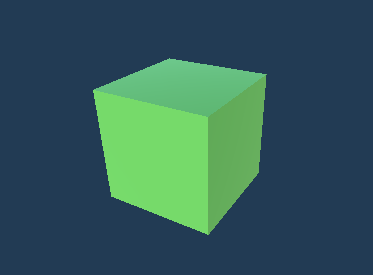

Every grid tile is a game object with a set position in the world view.

  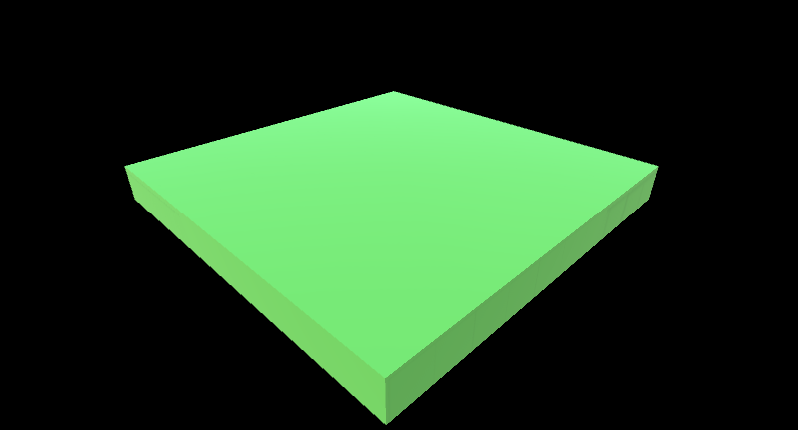

Every grid is shown with a UI when the mouse is hovered over the specific grid.

  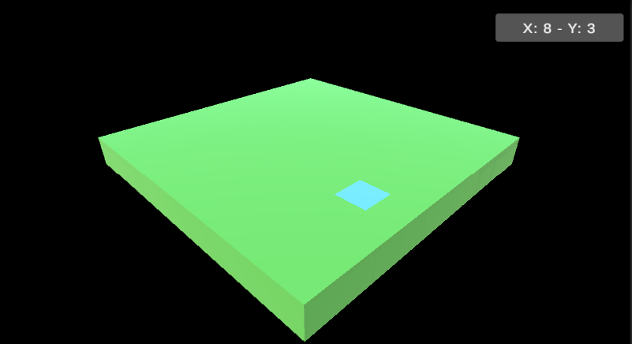

## Obstacles
An obstacle is created using a red sphere.

  

A ScriptableObject is created to store the data where the obstacle is placed on the grid.

  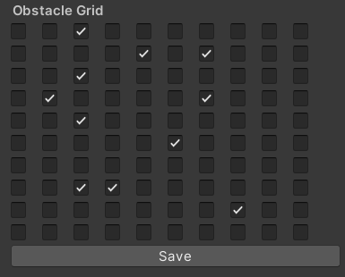

The Grid View with Obstacles : 

  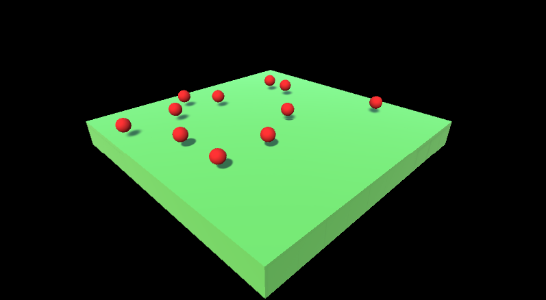

Another changed data for obstacles.

  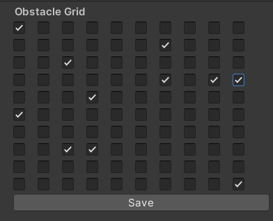

The Grid View with Obstacles : 

  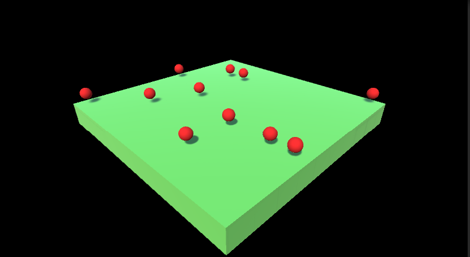

## Player 
A player is created and placed on the generated grid. 

  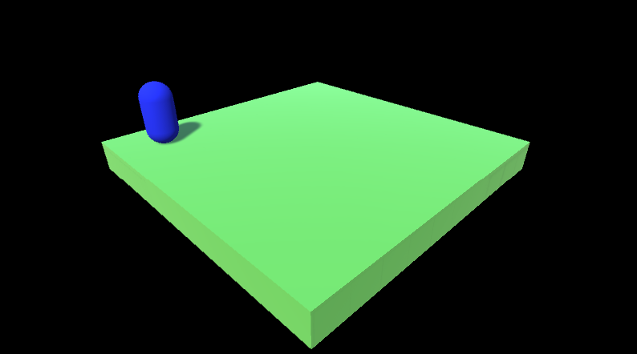

The player checks for obstacles. 

  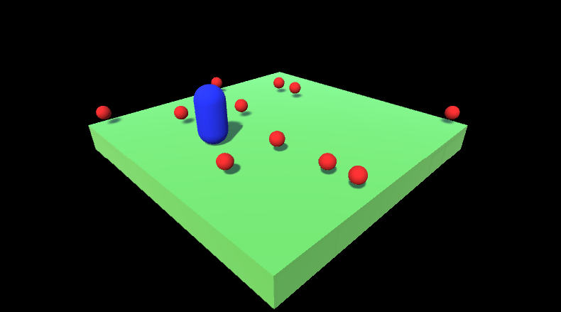

The player moves on the grid while avoiding the obstacles.

## Enemy
An enemy is added on the grid using an enemy spawner.

  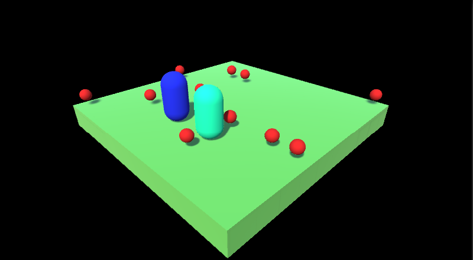

The enemy traces the player and reaches the nearest adjacent tile.
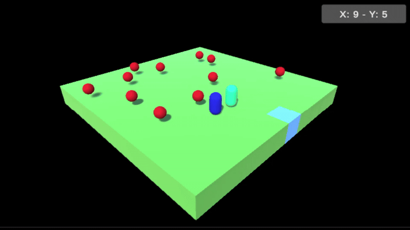
